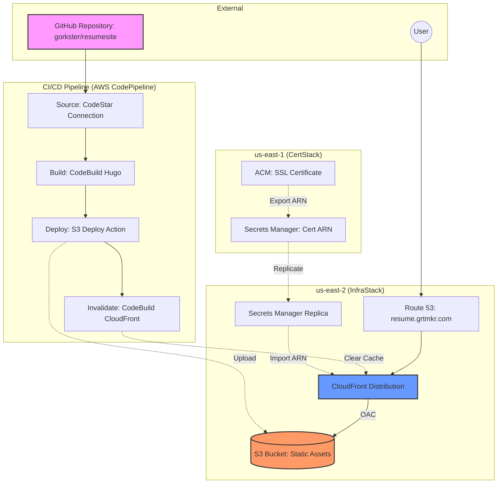

# Andrew Gortmaker - Resume Site

This project is a serverless static website hosting Andrew Gortmaker's resume, built with Hugo and deployed to AWS using CDK.

## Architecture

The following diagram illustrates the serverless architecture and the CI/CD pipeline. 

> **Note:** This diagram is written in [Mermaid](https://mermaid-js.github.io/mermaid/#/) format and will render automatically as an image on GitHub and most modern Markdown viewers.



### Key Components
- **Hugo**: Static site generator used to build the resume content.
- **AWS CDK**: Infrastructure as Code (IaC) to define and deploy the AWS resources.
- **Amazon S3**: Hosts the static website files.
- **Amazon CloudFront**: CDN for global delivery and HTTPS termination.
- **Amazon Route 53**: DNS management for the custom domain (`resume.grtmkr.com`).
- **AWS Certificate Manager (ACM)**: Provides the SSL/TLS certificate (in `us-east-1`).
- **AWS Secrets Manager**: Used to replicate the Certificate ARN from `us-east-1` to `us-east-2`.
- **AWS CodePipeline & CodeBuild**: Automates the build and deployment process from GitHub.

## Workflow

### Syncing Content
The site content is managed via a master markdown file. To sync the master CV to the Hugo site, use:
```bash
./sync_cv.sh
```
This script updates `content/_index.md` and applies Hugo shortcodes for contact obfuscation.

## Local Development

### Prerequisites
- [Hugo](https://gohugo.io/installation/)
- [Node.js & npm](https://nodejs.org/)
- [AWS CLI](https://aws.amazon.com/cli/) configured with appropriate credentials.

### Running Hugo Locally
```bash
hugo server -D
```

### Deploying Infrastructure
1. Navigate to the `infra` directory:
   ```bash
   cd infra
   npm install
   ```
2. Set up your `.env` configuration file from the template:
   ```bash
   cp .env.example .env
   # Edit .env with your HOSTED_ZONE_ID and CODESTAR_CONNECTION_ARN
   ```
3. Deploy the CDK stacks:
   ```bash
   npx cdk deploy --all
   ```
4. Populate the AWS Secrets Manager environment secret for CodeBuild:
   ```bash
   npm run update-secret
   # or run ./update-secret.sh
   ```
